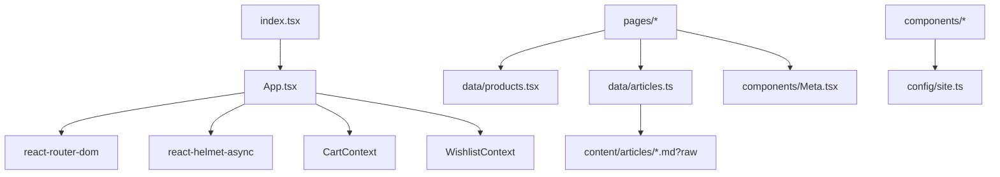

# المعمارية

## نظرة عامة
- **نوع الواجهة**: تطبيق React SPA يعمل بالكامل على المتصفح (لا يوجد Backend ضمن هذا المستودع).
- **أداة البناء**: Vite ([vite.config.ts](file:///workspace/vite.config.ts)).
- **التنسيق**: Tailwind CSS ([index.css](file:///workspace/index.css)، [tailwind.config.js](file:///workspace/tailwind.config.js)).
- **التوجيه (Routing)**: React Router DOM (جدول الراوتات في [App.tsx](file:///workspace/App.tsx#L99-L116)).
- **الحركات والأيقونات**: Framer Motion + Lucide.
- **النشر**: GitHub Pages (ووركفلو النشر في [deploy-gh-pages.yml](file:///workspace/.github/workflows/deploy-gh-pages.yml)).

## الإقلاع وقت التشغيل (Runtime Bootstrap)

### غلاف HTML
- ملف [index.html](file:///workspace/index.html) يحتوي على: وسوم meta الأساسية، Structured Data، شاشة تحميل ثابتة (Splash Loader)، وحل إعادة توجيه الروابط العميقة على GitHub Pages.
- شاشة التحميل موجودة خارج `#root` ويتم حذفها فقط بعد اكتمال `window.load` مع “buffer” للرسم (paint buffer) في [index.tsx](file:///workspace/index.tsx#L13-L36).

### إقلاع React
- يتم تركيب React داخل `#root` في [index.tsx](file:///workspace/index.tsx#L8-L12).
- يتم تهيئة React Query بشكل عام (حتى لو الاستخدام الحالي يغلب عليه البيانات الثابتة) في [index.tsx](file:///workspace/index.tsx#L39-L54).

### تركيب التطبيق
الملف [App.tsx](file:///workspace/App.tsx) يجمع الـ providers ومكوّنات الواجهة العامة:
- احتواء الأخطاء: [ErrorBoundary](file:///workspace/components/ErrorBoundary.tsx)
- الحالة: [CartProvider](file:///workspace/context/CartContext.tsx)، [WishlistProvider](file:///workspace/context/WishlistContext.tsx)
- مزوّد SEO: `HelmetProvider` (react-helmet-async)
- الراوتر: `BrowserRouter`
- طبقات فوقية (Overlays) على مستوى التطبيق: [CartSidebar](file:///workspace/components/CartSidebar.tsx)، [WishlistSidebar](file:///workspace/components/WishlistSidebar.tsx)، [FloatingWhatsApp](file:///workspace/components/FloatingWhatsApp.tsx)

## معمارية التوجيه (Routing)

### جدول الراوتات
الصفحات يتم تحميلها كسولاً (Lazy Loading) لتحقيق code-splitting (راجع `React.lazy` في أعلى [App.tsx](file:///workspace/App.tsx#L15-L50)).

خريطة الراوتات الأساسية (المصدر: [App.tsx](file:///workspace/App.tsx#L99-L116)):
- `/` → Home
- `/shop` and `/store` → Shop listing (alias)
- `/product/:slug` → Product details
- `/articles` → Article list
- `/articles/:articleId` → Article detail
- `/custom-mixtures` → Custom mixtures & “smart assistant”
- `/cart`, `/wishlist` → Full pages (sidebars also exist globally)
- `/about-us`, `/quality-standards`, `/faq`, `/return-policy`

### استراتيجية الـ Layout
- الصفحة الرئيسية تقوم بتركيب واجهتها بذاتها (Header/Footer داخل الصفحة).
- باقي الصفحات تستخدم `PageLayout` في [App.tsx](file:///workspace/App.tsx#L52-L58) لتوحيد Header/Footer و `<main id="main-content">`.

## دعم الروابط العميقة على GitHub Pages
GitHub Pages يقدم ملفات ثابتة ولا يدعم SPA deep-links تلقائياً. هذا المشروع يستخدم استراتيجية إعادة توجيه شائعة:
- [public/404.html](file:///workspace/public/404.html#L15-L24) يعيد كتابة أي مسار غير معروف إلى `/?p=<المسار_الأصلي_مشفّر>`.
- عند التحميل، كل من:
  - [index.html](file:///workspace/index.html#L168-L177) و
  - [App.tsx](file:///workspace/App.tsx#L73-L80)
  يقرأ `p` ثم يستدعي `history.replaceState` لإرجاع المسار المقصود داخل الـ SPA.

## الاعتماديات الأساسية وقت التشغيل

