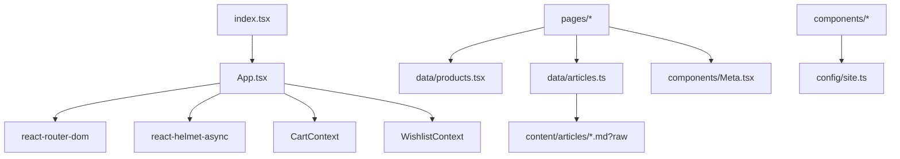

# Architecture

## System Overview
- **Frontend type**: Client-side rendered React SPA (no backend in this repository).
- **Build tool**: Vite ([vite.config.ts](file:///workspace/vite.config.ts)).
- **Styling**: Tailwind CSS ([index.css](file:///workspace/index.css), [tailwind.config.js](file:///workspace/tailwind.config.js)).
- **Routing**: React Router DOM (route table in [App.tsx](file:///workspace/App.tsx#L99-L116)).
- **Animations & icons**: Framer Motion + Lucide.
- **Deployment**: GitHub Pages (CI workflow in [deploy-gh-pages.yml](file:///workspace/.github/workflows/deploy-gh-pages.yml)).

## Runtime Bootstrap

### HTML shell
- The HTML shell defines base meta tags, structured data, a persistent splash loader, and a GitHub Pages deep-link redirect fix in [index.html](file:///workspace/index.html).
- The splash loader is a DOM node outside `#root` and is removed only after the `window.load` + extra paint-buffer logic in [index.tsx](file:///workspace/index.tsx#L13-L36).

### React bootstrap
- React mounts into `#root` in [index.tsx](file:///workspace/index.tsx#L8-L12).
- React Query is initialized globally (even though the current codebase primarily uses static data) in [index.tsx](file:///workspace/index.tsx#L39-L54).

### Application composition
[App.tsx](file:///workspace/App.tsx) composes cross-cutting providers and global UI:
- Error containment: [ErrorBoundary](file:///workspace/components/ErrorBoundary.tsx)
- State: [CartProvider](file:///workspace/context/CartContext.tsx), [WishlistProvider](file:///workspace/context/WishlistContext.tsx)
- SEO provider: `HelmetProvider` (react-helmet-async)
- Router: `BrowserRouter`
- Global overlays: [CartSidebar](file:///workspace/components/CartSidebar.tsx), [WishlistSidebar](file:///workspace/components/WishlistSidebar.tsx), [FloatingWhatsApp](file:///workspace/components/FloatingWhatsApp.tsx)

## Routing Architecture

### Route table
Routes are lazy-loaded for code-splitting (see the `React.lazy` imports at the top of [App.tsx](file:///workspace/App.tsx#L15-L50)).

Primary route mapping (source of truth: [App.tsx](file:///workspace/App.tsx#L99-L116)):
- `/` → Home
- `/shop` and `/store` → Shop listing (alias)
- `/product/:slug` → Product details
- `/articles` → Article list
- `/articles/:articleId` → Article detail
- `/custom-mixtures` → Custom mixtures & “smart assistant”
- `/cart`, `/wishlist` → Full pages (sidebars also exist globally)
- `/about-us`, `/quality-standards`, `/faq`, `/return-policy`

### Layout strategy
- Home uses its own composition (header/footer are included inside the page component).
- Other routes use `PageLayout` inside [App.tsx](file:///workspace/App.tsx#L52-L58) to standardize Header/Footer + `<main id="main-content">`.

## GitHub Pages Deep-Link Handling
GitHub Pages serves a static site and does not natively support SPA deep links. This repo implements a common redirect strategy:
- `public/404.html` rewrites unknown routes to `/?p=<encodedOriginalPath>` ([404.html](file:///workspace/public/404.html#L15-L24)).
- On load, both:
  - [index.html](file:///workspace/index.html#L168-L177) and
  - [App.tsx](file:///workspace/App.tsx#L73-L80)
  read query param `p` and `history.replaceState` back to the intended client route.

## Key Dependencies (Runtime)

