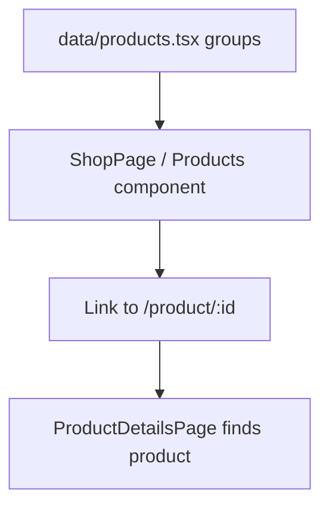
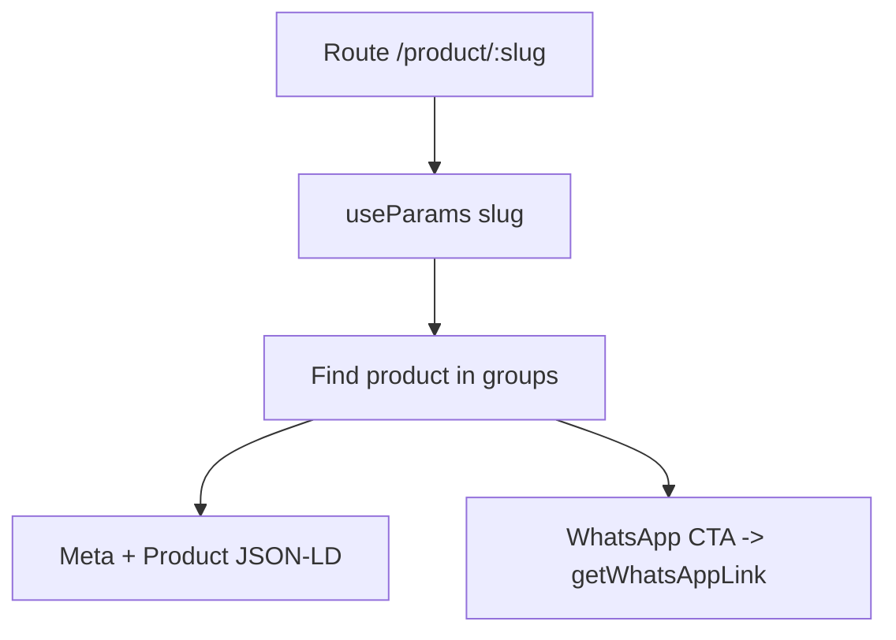
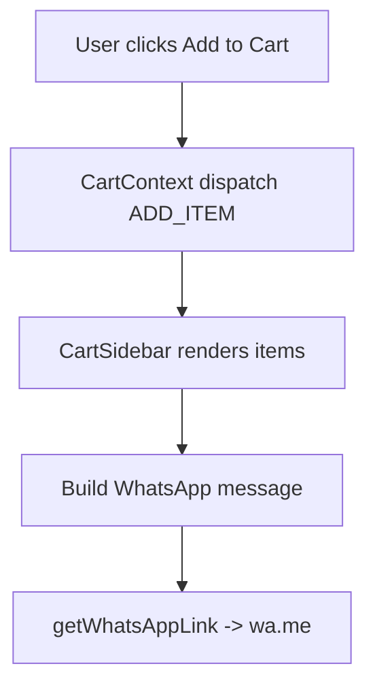
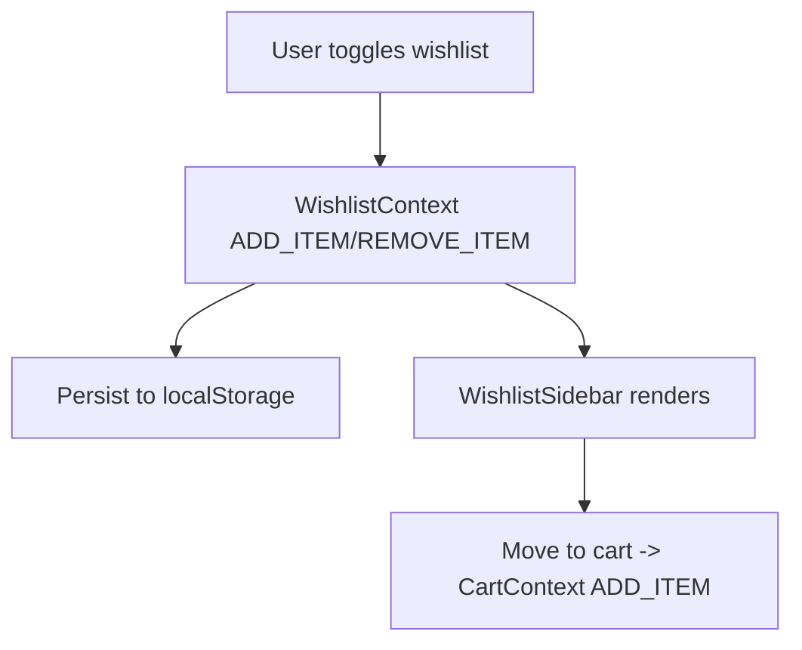
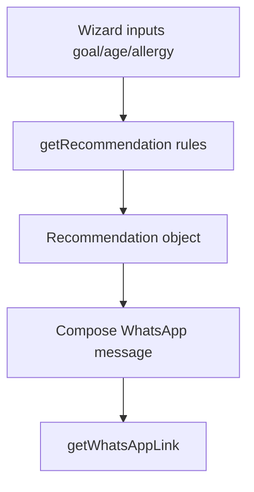

# تدفق البيانات حسب الميزة (Data Flow by Feature)

هذه الصفحة تشرح كيف تنتقل البيانات داخل التطبيق لكل ميزة رئيسية: من مصادر البيانات، إلى الصفحات، إلى المكوّنات، ثم إلى التفاعل النهائي (مثل إرسال طلب عبر واتساب).

## 1) المنتجات (الكتالوج)

**مصدر البيانات**
- [products.tsx](file:///workspace/data/products.tsx): `groups: ProductGroup[]` يحتوي مجموعات ومنتجات.

**أماكن العرض**
- صفحة المتجر: [ShopPage](file:///workspace/pages/ShopPage.tsx)
- أقسام المنتجات في الرئيسية: [Products](file:///workspace/components/Products.tsx)

**التنقل**
- عند الضغط على منتج يتم الانتقال إلى `/product/:slug` حيث `slug = product.id`.



## 2) صفحة تفاصيل المنتج

**آلية الجلب/البحث**
- تعتمد على `useParams` للحصول على `slug` ثم تبحث عن المنتج عبر flatten لكل `groups` في [ProductDetailsPage](file:///workspace/pages/ProductDetailsPage.tsx#L14-L18).

**SEO داخل الصفحة**
- تستخدم [Meta](file:///workspace/components/Meta.tsx) لضبط title/description/canonical.
- تضيف Product JSON-LD عبر `<script type="application/ld+json">` داخل children في [ProductDetailsPage](file:///workspace/pages/ProductDetailsPage.tsx#L41-L83).

**التفاعل**
- زر “اطلب الآن عبر واتساب” يبني رابط واتساب عبر [getWhatsAppLink](file:///workspace/config/site.ts#L8-L15).



## 3) المقالات (Listing + Detail)

**مصدر البيانات**
- [content/articles](file:///workspace/content/articles): ملفات Markdown.
- [articles.ts](file:///workspace/data/articles.ts): يستورد markdown كـ raw strings ويعرّف `Article[]`.

**العرض**
- قائمة المقالات: [ArticlesPage](file:///workspace/pages/ArticlesPage.tsx)
- تفاصيل المقال: [ArticleDetailPage](file:///workspace/pages/ArticleDetailPage.tsx)

**تحويل Markdown**
- [MarkdownContent](file:///workspace/components/MarkdownContent.tsx) يحوّل Markdown إلى HTML مُنقّى (sanitized) ثم يعرضه.

```mermaid
flowchart TD
  A[content/articles/*.md] --> B[data/articles.ts (?raw)]
  B --> C[ArticlesPage list]
  B --> D[ArticleDetailPage selects by id]
  D --> E[MarkdownContent -> HTML]
```

## 4) السلة (Cart)

**مصدر الحقيقة**
- [CartContext](file:///workspace/context/CartContext.tsx): `cartReducer` + `CartProvider`.
- الاستهلاك عبر [useCart](file:///workspace/hooks/useCart.ts).

**واجهات المستخدم**
- Overlay دائم: [CartSidebar](file:///workspace/components/CartSidebar.tsx)
- صفحة كاملة: [CartPage](file:///workspace/pages/CartPage.tsx)

**الطلب عبر واتساب**
- يتم توليد رسالة نصية من عناصر السلة ثم فتح رابط واتساب في [CartSidebar](file:///workspace/components/CartSidebar.tsx#L12-L17).



## 5) المفضلة (Wishlist)

**مصدر الحقيقة**
- [WishlistContext](file:///workspace/context/WishlistContext.tsx): reducer + persistence.
- التخزين: `localStorage` بمفتاح `alhaytham-wishlist` في [WishlistContext](file:///workspace/context/WishlistContext.tsx#L25-L42).

**واجهات المستخدم**
- Overlay دائم: [WishlistSidebar](file:///workspace/components/WishlistSidebar.tsx)
- صفحة كاملة: [WishlistPage](file:///workspace/pages/WishlistPage.tsx)

**نقل إلى السلة**
- زر “للسلة” في [WishlistSidebar](file:///workspace/components/WishlistSidebar.tsx#L14-L17) يقوم:
  - `addToCart(...)`
  - ثم `removeItem(...)` من المفضلة



## 6) المساعد الذكي للخلطات

**المنطق**
- محرك توصية قواعدي داخل [SmartMixtureAssistant](file:///workspace/components/SmartMixtureAssistant.tsx#L52-L106) يعتمد على:
  - وجود حساسية
  - الهدف
  - العمر (حالة خاصة لمناعة الأطفال)

**الناتج النهائي**
- توليد رسالة واتساب تحتوي مدخلات المستخدم + التوصية، ثم بناء رابط عبر [getWhatsAppLink](file:///workspace/config/site.ts#L8-L15) داخل [SmartMixtureAssistant](file:///workspace/components/SmartMixtureAssistant.tsx#L136-L145).



