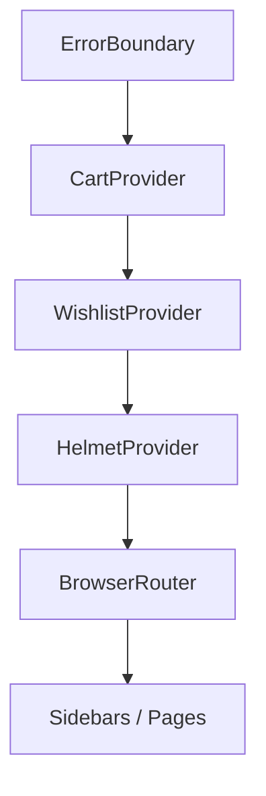

# State Management

The app uses React Context + `useReducer` for global UI state (cart and wishlist). Access is wrapped with dedicated hooks.

## Cart

**Source**
- Provider + reducer: [CartContext](file:///workspace/context/CartContext.tsx)
- Hook: [useCart](file:///workspace/hooks/useCart.ts)

**State shape**
- `items: CartItem[]`
- `isOpen: boolean` (controls the sidebar visibility)

**Key reducer logic**
- `cartReducer` adds/increments items and ensures quantity never drops below 0 (and removes items when quantity reaches 0) in [CartContext](file:///workspace/context/CartContext.tsx#L31-L75).
- Derived value `totalItems` is computed as a sum of item quantities in [CartContext](file:///workspace/context/CartContext.tsx#L121-L126).

**Primary consumers**
- Sidebar overlay: [CartSidebar](file:///workspace/components/CartSidebar.tsx)
- Full page: [CartPage](file:///workspace/pages/CartPage.tsx)

**Checkout model**
- There is no payment backend in this repo. “Checkout” is a generated WhatsApp message built from cart items in [CartSidebar](file:///workspace/components/CartSidebar.tsx#L12-L17), using [getWhatsAppLink](file:///workspace/config/site.ts#L8-L15).

## Wishlist

**Source**
- Provider + reducer: [WishlistContext](file:///workspace/context/WishlistContext.tsx)
- Hook: [useWishlist](file:///workspace/hooks/useWishlist.ts)

**State shape**
- `items: WishlistItem[]`
- `isOpen: boolean` (controls the sidebar visibility)

**Persistence**
- Wishlist is loaded and persisted to `localStorage` under key `alhaytham-wishlist` via:
  - `getStoredWishlist()` ([WishlistContext](file:///workspace/context/WishlistContext.tsx#L27-L34))
  - `saveToStorage()` ([WishlistContext](file:///workspace/context/WishlistContext.tsx#L36-L42))
  - `useEffect` persistence hook ([WishlistContext](file:///workspace/context/WishlistContext.tsx#L92-L96))

**Primary consumers**
- Sidebar overlay: [WishlistSidebar](file:///workspace/components/WishlistSidebar.tsx)
- Full page: [WishlistPage](file:///workspace/pages/WishlistPage.tsx)

**Wishlist → Cart flow**
- The sidebar offers a “move to cart” interaction implemented in [WishlistSidebar](file:///workspace/components/WishlistSidebar.tsx#L14-L17).

## Provider Composition

