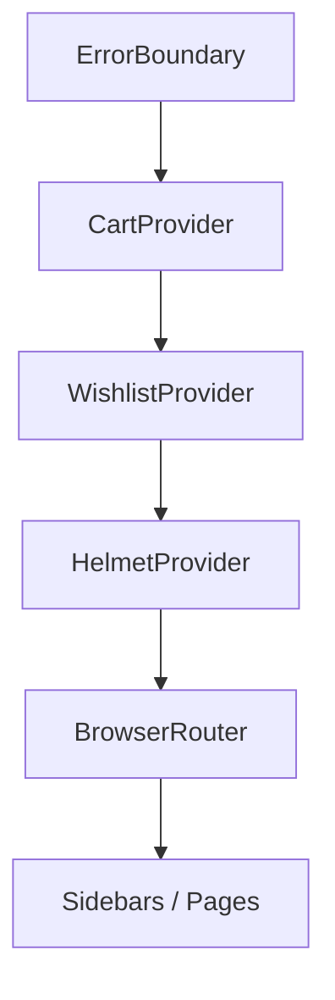

# إدارة الحالة (State Management)

التطبيق يستخدم React Context + `useReducer` لإدارة الحالة العامة للواجهة (السلة والمفضلة). الوصول للحالة يتم عبر hooks مخصصة.

## السلة (Cart)

**المصدر**
- الـ Provider والـ reducer: [CartContext](file:///workspace/context/CartContext.tsx)
- الـ Hook: [useCart](file:///workspace/hooks/useCart.ts)

**شكل الحالة (State shape)**
- `items: CartItem[]`
- `isOpen: boolean` (controls the sidebar visibility)

**منطق reducer الأساسي**
- `cartReducer` يضيف/يزيد الكميات ويضمن أن الكمية لا تنخفض تحت 0 (ويحذف العنصر عندما تصل الكمية إلى 0) في [CartContext](file:///workspace/context/CartContext.tsx#L31-L75).
- القيمة المشتقة `totalItems` تُحسب كمجموع كميات العناصر في [CartContext](file:///workspace/context/CartContext.tsx#L121-L126).

**أهم نقاط الاستخدام**
- الشريط الجانبي (Overlay): [CartSidebar](file:///workspace/components/CartSidebar.tsx)
- الصفحة الكاملة: [CartPage](file:///workspace/pages/CartPage.tsx)

**نموذج الطلب (Checkout)**
- لا يوجد دفع أو Backend هنا. “الطلب” هو رسالة واتساب يتم توليدها من عناصر السلة في [CartSidebar](file:///workspace/components/CartSidebar.tsx#L12-L17)، باستخدام [getWhatsAppLink](file:///workspace/config/site.ts#L8-L15).

## المفضلة (Wishlist)

**المصدر**
- الـ Provider والـ reducer: [WishlistContext](file:///workspace/context/WishlistContext.tsx)
- الـ Hook: [useWishlist](file:///workspace/hooks/useWishlist.ts)

**شكل الحالة (State shape)**
- `items: WishlistItem[]`
- `isOpen: boolean` (controls the sidebar visibility)

**التخزين**
- يتم تحميل/حفظ المفضلة في `localStorage` تحت المفتاح `alhaytham-wishlist` عبر:
  - `getStoredWishlist()` ([WishlistContext](file:///workspace/context/WishlistContext.tsx#L27-L34))
  - `saveToStorage()` ([WishlistContext](file:///workspace/context/WishlistContext.tsx#L36-L42))
  - `useEffect` لحفظ التغييرات ([WishlistContext](file:///workspace/context/WishlistContext.tsx#L92-L96))

**أهم نقاط الاستخدام**
- الشريط الجانبي (Overlay): [WishlistSidebar](file:///workspace/components/WishlistSidebar.tsx)
- الصفحة الكاملة: [WishlistPage](file:///workspace/pages/WishlistPage.tsx)

**نقل من المفضلة إلى السلة**
- الشريط الجانبي يوفر خيار “نقل إلى السلة” في [WishlistSidebar](file:///workspace/components/WishlistSidebar.tsx#L14-L17).

## تركيب الـ Providers

